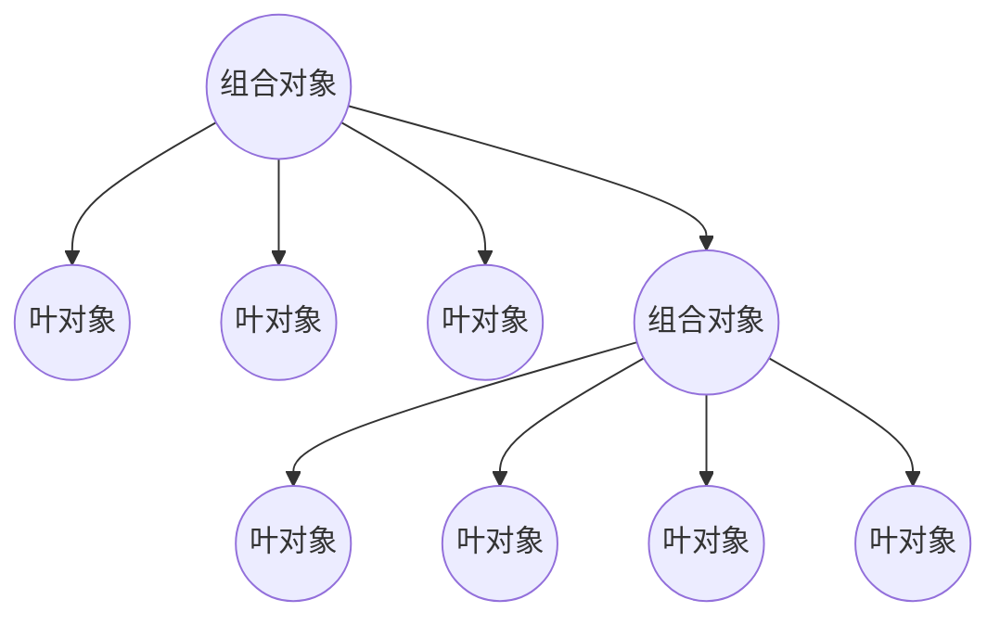

组合模式简单来讲类似于一棵树，父节点和子节点有着类似的结构

<!-- more -->

形如

虽然上面说了类似“父子节点”这个字眼,但是组合模式并**不是父子关系**,更多的是**部分-整体**的关系.除了用来表示树形结构外,组合模式能更好的运用对象的多态特性.用户对单个对象和组合对象的使用有着一致性

### 扫描文件夹例子

> 我这里需要实现一个文件夹和文件的扫描的需求.当我选择某个文件夹的时候递归吧所有子文件和子文件夹下的所有文件都显示出来.同时我还需要实现文件夹和文件的删除功能.



<!-- 

 -->
